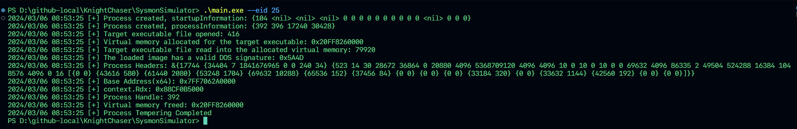
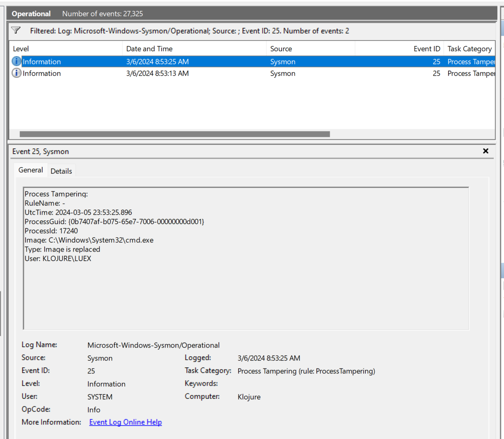

# SysmonSimulator
A naive and experimental commandline simulator for System Monitor(Sysmon) testing written in Go language.

Inspired from `ScarredMonk`'s SysmonSimulator project(https://github.com/ScarredMonk/SysmonSimulator), but I rewrote it into Go language (and a little spoon amount of Powershell script too). Basically, Sysmon works depends on its associated XML ruleset. I assume your Sysmon configuration complies to `Sysmon-modular` project, which is a popular open source project for general Sysmon configuration setup.

### How to use
1. Build the project `go build main.go` at the root repository of this project(You might be required to use Go compilers with 1.21 or higher version.).
2. Run `./main.exe --eid XXX`. Some event generation has a dependency to user's manual input. Refer to the `root.go`.
- For example, if you want to trigger **`ProcessTampering(EID 25)`** events artifically via this project, build the project and hit `./main.exe --eid 25`, and the result will be like pictures below.

(Event Triggerd)

(The event was logged at Sysmon)

### Supported Sysmon-defined events

Some events requires additional parameters that the user manually inputs. **type `./main.exe --help`**(_If you build this project_) to get helpful information about the parameters.
- EID 01: ProcessCreate
- EID 02: FileCreationTimeChanged
- EID 03: NetworkConnect
- EID 05: ProcessTermination
- EID 06: DriverLoaded
- EID 07: ImageLoaded
- EID 08: CreateRemoteThread
- EID 09: RawAccessRead
- EID 10: ProcessAccessed
- EID 11: FileCreated
- EID 12: CreateRegistryKey
- EID 13: RegistryValueSet
- EID 14: RegistryObjectRenamed
- EID 15: FileStreamCreated
- EID 17: PipeCreated
- EID 18: PipeConnected
- EID 19: WmiEventFilterActivityDetected
- EID 20: WmiEventConsumerActivityDetected
- EID 21: WmiEventConsumerToFilterActivityDetected
- EID 22: DnsQuery
- EID 25: ProcessTampering
- EID 26: FileDeleted

### Note
- Due to the characteristics of Sysmon, this project uses lots of 
**WindowsAPI(WINAPI)** functions like `CreateProcess()`(Quite often, this directly loads functions from the related DLL files) to simulate the real events that Sysmon defined. This project is intended to be used at WINDOWS OS(x64 architecture) 10 or higher.
- This project is not stable or for production. It's much closer to implementation experiment (and it was horrible indeed.)